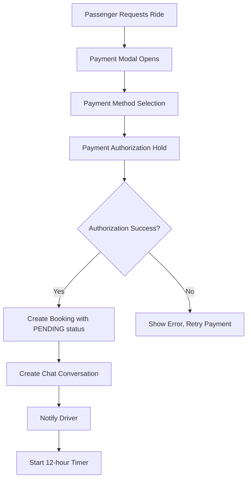
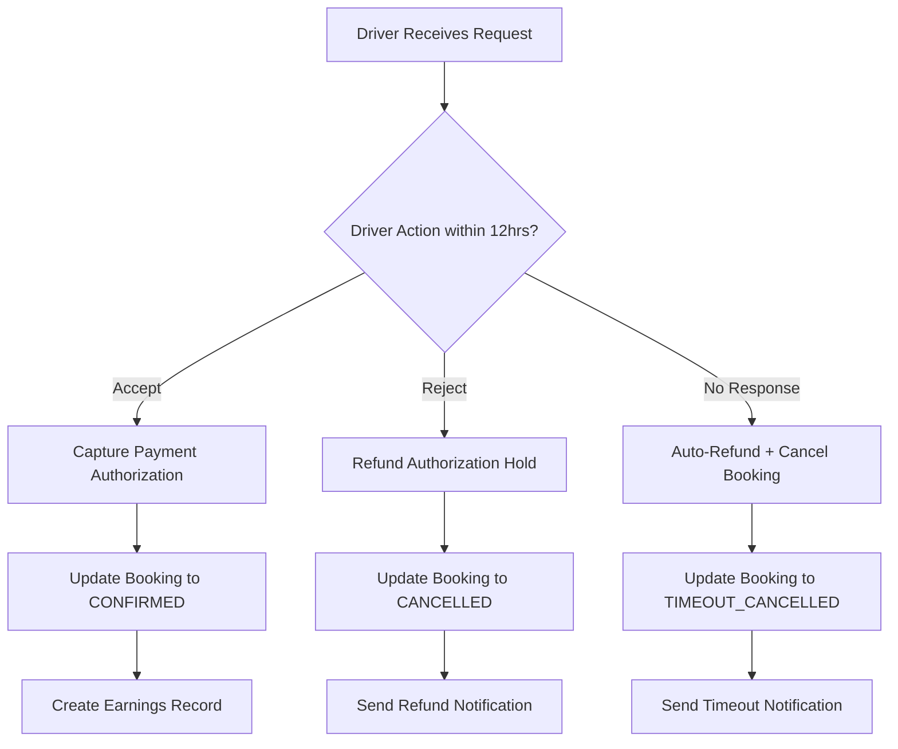

# Payment Hold System Architecture

## Overview

This document outlines the comprehensive payment hold system for OnGoPool ride requests. The system ensures secure payment processing with authorization holds, automatic timeouts, and refund handling.

## Payment Flow Architecture

### 1. Payment Hold on Ride Request



### 2. Driver Response Flow



## Database Schema Updates

### Enhanced Payments Table

```sql
CREATE TABLE payments (
    id BIGSERIAL PRIMARY KEY,
    booking_id BIGINT NOT NULL REFERENCES ride_bookings(id),
    user_id UUID NOT NULL REFERENCES users(id),
    amount NUMERIC(10,2) NOT NULL,
    currency VARCHAR(3) DEFAULT 'USD',
    status VARCHAR(20) NOT NULL CHECK (status IN (
        'authorized',        -- Payment hold created
        'captured',         -- Payment processed successfully  
        'refunded',         -- Payment refunded
        'failed',           -- Payment failed
        'expired'           -- Authorization expired
    )),
    payment_method VARCHAR(20) NOT NULL,
    payment_intent_id VARCHAR(255),      -- Stripe Payment Intent ID
    authorization_id VARCHAR(255),       -- Payment authorization ID
    transaction_id VARCHAR(255),         -- Final transaction ID
    refund_id VARCHAR(255),             -- Refund transaction ID
    refund_reason VARCHAR(50),          -- Reason for refund
    expires_at TIMESTAMP,               -- Authorization expiry time
    captured_at TIMESTAMP,              -- When payment was captured
    refunded_at TIMESTAMP,              -- When refund was processed
    created_at TIMESTAMP DEFAULT NOW(),
    updated_at TIMESTAMP DEFAULT NOW()
);
```

### Enhanced Ride Bookings Table

```sql
-- Add new status values to ride_bookings
ALTER TABLE ride_bookings 
ADD CONSTRAINT booking_status_check 
CHECK (status IN (
    'pending',           -- Awaiting driver response
    'confirmed',         -- Driver accepted, payment captured
    'cancelled',         -- Driver rejected or passenger cancelled
    'timeout_cancelled', -- No driver response within 12 hours
    'expired'           -- Booking expired due to ride start time
));

-- Add payment tracking fields
ALTER TABLE ride_bookings 
ADD COLUMN payment_authorized_at TIMESTAMP,
ADD COLUMN payment_expires_at TIMESTAMP,
ADD COLUMN response_deadline TIMESTAMP,
ADD COLUMN can_cancel_after_confirm BOOLEAN DEFAULT FALSE;
```

### New Payment Hold Tracking Table

```sql
CREATE TABLE payment_holds (
    id BIGSERIAL PRIMARY KEY,
    booking_id BIGINT NOT NULL REFERENCES ride_bookings(id),
    payment_id BIGINT NOT NULL REFERENCES payments(id),
    hold_amount NUMERIC(10,2) NOT NULL,
    hold_created_at TIMESTAMP DEFAULT NOW(),
    hold_expires_at TIMESTAMP NOT NULL,
    auto_release_scheduled_at TIMESTAMP,
    status VARCHAR(20) DEFAULT 'active' CHECK (status IN (
        'active',     -- Hold is active
        'captured',   -- Hold was captured
        'released',   -- Hold was released (refunded)
        'expired'     -- Hold expired automatically
    )),
    created_at TIMESTAMP DEFAULT NOW(),
    updated_at TIMESTAMP DEFAULT NOW()
);
```

## Service Architecture

### 1. Payment Hold Service

```typescript
interface PaymentHoldService {
  // Create payment authorization hold
  createPaymentHold(bookingData: BookingRequest): Promise<PaymentHoldResult>;
  
  // Capture authorized payment when driver accepts
  capturePaymentHold(bookingId: number): Promise<PaymentCaptureResult>;
  
  // Release payment hold when driver rejects or timeout
  releasePaymentHold(bookingId: number, reason: RefundReason): Promise<PaymentRefundResult>;
  
  // Check and process expired holds
  processExpiredHolds(): Promise<void>;
}

interface PaymentHoldResult {
  success: boolean;
  paymentId: number;
  authorizationId: string;
  expiresAt: Date;
  error?: string;
}
```

### 2. Booking Timeout Service

```typescript
interface BookingTimeoutService {
  // Schedule automatic timeout for booking
  scheduleBookingTimeout(bookingId: number, timeoutHours: number): Promise<void>;
  
  // Cancel scheduled timeout when driver responds
  cancelBookingTimeout(bookingId: number): Promise<void>;
  
  // Process all timed-out bookings
  processTimeoutBookings(): Promise<void>;
  
  // Check if booking is within response window
  isWithinResponseWindow(bookingId: number): Promise<boolean>;
}
```

### 3. Driver Response Handler

```typescript
interface DriverResponseHandler {
  // Handle driver acceptance
  acceptRideRequest(bookingId: number, driverId: string): Promise<AcceptanceResult>;
  
  // Handle driver rejection  
  rejectRideRequest(bookingId: number, driverId: string, reason?: string): Promise<RejectionResult>;
  
  // Validate driver can still respond
  canDriverRespond(bookingId: number): Promise<boolean>;
}

interface AcceptanceResult {
  success: boolean;
  paymentCaptured: boolean;
  earningsCreated: boolean;
  bookingConfirmed: boolean;
  error?: string;
}
```

## Payment Processing Logic

### Authorization Hold Creation

```typescript
async function createPaymentAuthorization(
  amount: number, 
  paymentMethod: PaymentMethodDetails,
  bookingId: number
): Promise<PaymentHoldResult> {
  
  // 1. Create Stripe Payment Intent with manual capture
  const paymentIntent = await stripe.paymentIntents.create({
    amount: Math.round(amount * 100), // Convert to cents
    currency: 'usd',
    payment_method: paymentMethod.id,
    confirmation_method: 'manual',
    capture_method: 'manual', // This creates an authorization hold
    confirm: true,
    metadata: {
      booking_id: bookingId.toString(),
      type: 'ride_booking_hold'
    }
  });

  // 2. Store authorization in database
  const payment = await supabase
    .from('payments')
    .insert({
      booking_id: bookingId,
      user_id: userId,
      amount: amount,
      status: 'authorized',
      payment_method: paymentMethod.type,
      payment_intent_id: paymentIntent.id,
      authorization_id: paymentIntent.id,
      expires_at: new Date(Date.now() + 12 * 60 * 60 * 1000) // 12 hours
    })
    .select()
    .single();

  return {
    success: true,
    paymentId: payment.id,
    authorizationId: paymentIntent.id,
    expiresAt: payment.expires_at
  };
}
```

### Payment Capture on Driver Accept

```typescript
async function capturePaymentHold(bookingId: number): Promise<PaymentCaptureResult> {
  
  // 1. Get payment authorization details
  const { data: payment } = await supabase
    .from('payments')
    .select('*')
    .eq('booking_id', bookingId)
    .eq('status', 'authorized')
    .single();

  if (!payment) {
    throw new Error('No valid payment authorization found');
  }

  // 2. Check if authorization is still valid
  if (new Date() > new Date(payment.expires_at)) {
    throw new Error('Payment authorization has expired');
  }

  // 3. Capture payment via Stripe
  const paymentIntent = await stripe.paymentIntents.capture(
    payment.payment_intent_id
  );

  // 4. Update payment status
  await supabase
    .from('payments')
    .update({
      status: 'captured',
      transaction_id: paymentIntent.id,
      captured_at: new Date()
    })
    .eq('id', payment.id);

  // 5. Update booking status
  await supabase
    .from('ride_bookings')
    .update({
      status: 'confirmed'
    })
    .eq('id', bookingId);

  return {
    success: true,
    transactionId: paymentIntent.id,
    amountCaptured: payment.amount
  };
}
```

### Payment Refund on Driver Reject/Timeout

```typescript
async function refundPaymentHold(
  bookingId: number, 
  reason: 'driver_rejected' | 'timeout' | 'passenger_cancelled'
): Promise<PaymentRefundResult> {
  
  // 1. Get payment authorization
  const { data: payment } = await supabase
    .from('payments')
    .select('*')
    .eq('booking_id', bookingId)
    .eq('status', 'authorized')
    .single();

  // 2. Cancel the payment intent (releases the hold)
  const paymentIntent = await stripe.paymentIntents.cancel(
    payment.payment_intent_id
  );

  // 3. Update payment status
  await supabase
    .from('payments')
    .update({
      status: 'refunded',
      refund_reason: reason,
      refunded_at: new Date()
    })
    .eq('id', payment.id);

  // 4. Update booking status based on reason
  const bookingStatus = reason === 'timeout' ? 'timeout_cancelled' : 'cancelled';
  await supabase
    .from('ride_bookings')
    .update({
      status: bookingStatus
    })
    .eq('id', bookingId);

  return {
    success: true,
    refundAmount: payment.amount,
    reason: reason
  };
}
```

## Timeout Management

### Database Function for Timeout Processing

```sql
CREATE OR REPLACE FUNCTION process_booking_timeouts()
RETURNS void AS $$
BEGIN
  -- Find all bookings that have timed out
  UPDATE ride_bookings 
  SET 
    status = 'timeout_cancelled',
    updated_at = NOW()
  WHERE 
    status = 'pending' 
    AND response_deadline < NOW()
    AND status != 'timeout_cancelled';

  -- Update corresponding payments
  UPDATE payments 
  SET 
    status = 'refunded',
    refund_reason = 'timeout',
    refunded_at = NOW()
  WHERE 
    booking_id IN (
      SELECT id FROM ride_bookings 
      WHERE status = 'timeout_cancelled' 
      AND updated_at >= NOW() - INTERVAL '1 minute'
    )
    AND status = 'authorized';
    
END;
$$ LANGUAGE plpgsql;
```

### Automated Timeout Scheduler

```typescript
// Service to run every 5 minutes
export class BookingTimeoutScheduler {
  private intervalId: NodeJS.Timeout | null = null;

  start() {
    this.intervalId = setInterval(async () => {
      await this.processTimeouts();
    }, 5 * 60 * 1000); // Run every 5 minutes
  }

  stop() {
    if (this.intervalId) {
      clearInterval(this.intervalId);
      this.intervalId = null;
    }
  }

  private async processTimeouts() {
    try {
      // Call database function to update timed-out bookings
      await supabase.rpc('process_booking_timeouts');
      
      // Process Stripe payment intent cancellations
      await this.processStripeTimeouts();
      
      // Send notifications for timed-out bookings
      await this.sendTimeoutNotifications();
      
    } catch (error) {
      console.error('Error processing booking timeouts:', error);
    }
  }

  private async processStripeTimeouts() {
    // Get newly timed-out payments that need Stripe processing
    const { data: timedOutPayments } = await supabase
      .from('payments')
      .select('*')
      .eq('status', 'authorized')
      .eq('refund_reason', 'timeout')
      .is('refunded_at', null);

    for (const payment of timedOutPayments || []) {
      try {
        // Cancel the Stripe payment intent
        await stripe.paymentIntents.cancel(payment.payment_intent_id);
        
        // Update payment as processed
        await supabase
          .from('payments')
          .update({ refunded_at: new Date() })
          .eq('id', payment.id);
          
      } catch (error) {
        console.error(`Failed to cancel Stripe payment ${payment.id}:`, error);
      }
    }
  }
}
```

## Notification System

### Payment Status Notifications

```typescript
interface PaymentNotificationService {
  // Notify passenger of payment hold
  notifyPaymentAuthorized(bookingId: number): Promise<void>;
  
  // Notify passenger of successful payment capture
  notifyPaymentCaptured(bookingId: number): Promise<void>;
  
  // Notify passenger of refund
  notifyPaymentRefunded(bookingId: number, reason: RefundReason): Promise<void>;
  
  // Notify driver of pending payment
  notifyDriverPendingPayment(bookingId: number): Promise<void>;
}

// Notification messages based on payment status
const PAYMENT_NOTIFICATIONS = {
  authorized: {
    title: "Payment Authorized",
    message: "Your payment has been authorized. You'll only be charged if the driver accepts your ride request.",
    type: "info"
  },
  captured: {
    title: "Payment Confirmed", 
    message: "Your ride has been confirmed! Payment has been processed successfully.",
    type: "success"
  },
  refunded: {
    driver_rejected: {
      title: "Ride Request Declined",
      message: "The driver declined your request. Your payment has been refunded automatically.",
      type: "warning"
    },
    timeout: {
      title: "Request Timed Out", 
      message: "The driver didn't respond within 12 hours. Your payment has been refunded automatically.",
      type: "warning"
    }
  }
};
```

## No-Cancellation Policy

### Database Constraints

```sql
-- Add business rule enforcement
CREATE OR REPLACE FUNCTION enforce_no_cancellation_policy()
RETURNS TRIGGER AS $$
BEGIN
  -- Prevent cancellation of confirmed bookings unless explicitly allowed
  IF OLD.status = 'confirmed' AND NEW.status = 'cancelled' THEN
    IF NEW.can_cancel_after_confirm != TRUE THEN
      RAISE EXCEPTION 'Confirmed bookings cannot be cancelled. Contact support for assistance.';
    END IF;
  END IF;
  
  RETURN NEW;
END;
$$ LANGUAGE plpgsql;

CREATE TRIGGER prevent_confirmed_booking_cancellation
  BEFORE UPDATE ON ride_bookings
  FOR EACH ROW
  EXECUTE FUNCTION enforce_no_cancellation_policy();
```

### UI Enforcement

```typescript
// Check cancellation eligibility
function canCancelBooking(booking: RideBooking): boolean {
  // No cancellation allowed after confirmation
  if (booking.status === 'confirmed') {
    return booking.can_cancel_after_confirm || false;
  }
  
  // Allow cancellation of pending bookings (will trigger refund)
  if (booking.status === 'pending') {
    return true;
  }
  
  return false;
}

// Cancellation with refund policy
async function cancelBooking(bookingId: number): Promise<CancellationResult> {
  const booking = await getBooking(bookingId);
  
  if (!canCancelBooking(booking)) {
    throw new Error('This booking cannot be cancelled. Please contact support.');
  }
  
  if (booking.status === 'pending') {
    // Refund the payment hold
    await refundPaymentHold(bookingId, 'passenger_cancelled');
    return { success: true, refunded: true };
  }
  
  return { success: false, reason: 'Cancellation not allowed' };
}
```

## Refund Policy Implementation

### Time-Based Refund Rules

```typescript
interface RefundPolicy {
  // Full refund scenarios
  driverRejection: boolean;        // 100% refund
  driverNoResponse: boolean;       // 100% refund  
  passengerCancelPending: boolean; // 100% refund (before driver accepts)
  
  // No refund scenarios  
  confirmedBookings: boolean;      // 0% refund (no cancellation allowed)
}

const REFUND_POLICY: RefundPolicy = {
  driverRejection: true,      // Driver rejects = full refund
  driverNoResponse: true,     // 12hr timeout = full refund
  passengerCancelPending: true, // Cancel before driver accepts = full refund
  confirmedBookings: false    // No cancellation after confirmation
};

// Refund policy enforcement
function getRefundAmount(booking: RideBooking, reason: RefundReason): number {
  switch (reason) {
    case 'driver_rejected':
    case 'timeout':
    case 'passenger_cancelled':
      return booking.total_amount; // Full refund
      
    case 'confirmed_booking_exception':
      // Special cases only - requires admin approval
      return 0;
      
    default:
      return 0;
  }
}
```

This architecture provides a complete payment hold system that ensures:

1. **Payment Authorization**: Secure holds on booking requests
2. **Automatic Processing**: Driver responses trigger appropriate payment actions
3. **Timeout Management**: 12-hour automatic refunds for non-responsive drivers
4. **No-Cancellation Policy**: Prevents cancellations after ride confirmation
5. **Comprehensive Refund Policy**: Clear rules with automatic processing
6. **Notification System**: Real-time updates for all payment status changes

The system integrates seamlessly with the existing Supabase database, Stripe payment processing, and real-time chat functionality.